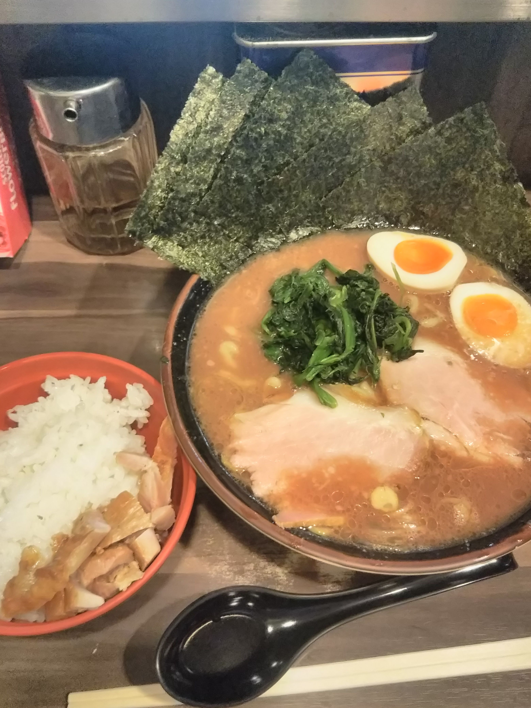

# ラーメン

## わいず
- [公式ホームページ](https://kandaramen-waizu.jp/)
- 家系ラーメンとして紹介されますが、家系ではない気がします。
- 東京で一番美味しいラーメンです。
- 両替機が不調で、お札がいつも入りません。
- 時々、着丼までに時間がかかってスープがぬるくなっています。
- チャーシューとほうれん草が冷たいので、スープが時々ぬるいです。
- 最近、刻みニンニクがなくなってしまい、ちょっと残念です。（2023年1月時点）

